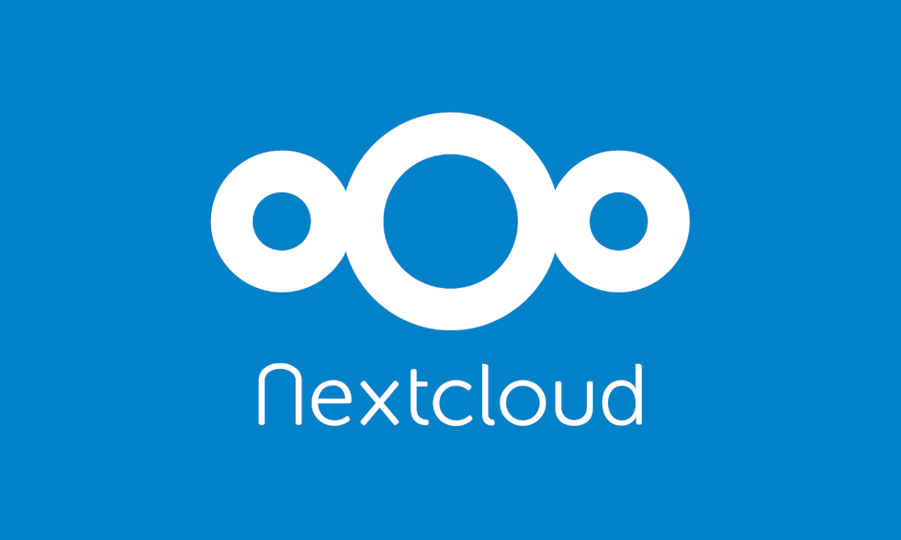
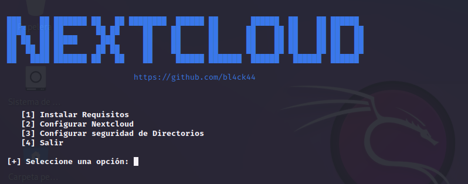

# Nextcloud

<p align="center">

</p>

Nextcloud es una plataforma de almacenamiento y colaboración de código abierto que permite a los usuarios gestinar y compartir archivos, colaborar en documentos, organizar calendarios y tareas, y más. Desarrollado inicialmente como un fork de ownCloud, Nextcloud se ha convertido en una solución popular y confiable utilizada por individuos, organizaciones y empresas para satisfacer sus necesidades de gestión de datos en la nube

Con este script podras configurar tu porpia nube.

```
git clone https://github.com/bl4ck44/Nextcloud.git

cd Nextcloud

chmod +x setup.sh

sudo bash setup.sh
```

<br>

**NOTA:** En el script de configuracion puedes editar el usuario y contraseña de la base de datos.

<p align="center">

</p>


Para cambiar la contraseña del usuario root:
```bash
mysql -e "ALTER USER 'root'@'localhost' IDENTIFIED WITH mysql_native_password by 'Password444@';"
```

Aqui creamos el usuario, contraseña y nombre de la base de datos:

```bash
mysql -u root -p -e "CREATE USER 'nextcloud'@'localhost' IDENTIFIED BY 'Password444@';"
mysql -u root -p -e "CREATE DATABASE nextcloud;"
mysql -u root -p -e "GRANT ALL PRIVILEGES ON nextcloud.* TO 'nextcloud'@'localhost';"
mysql -u root -p -e "FLUSH PRIVILEGES;"
```

**NOTA:** Al ejecutar el script te pedirá varias veces la contraseña deberes ingresar la contraseña que cambiaste en el archivo de configuración para la base de datos.


